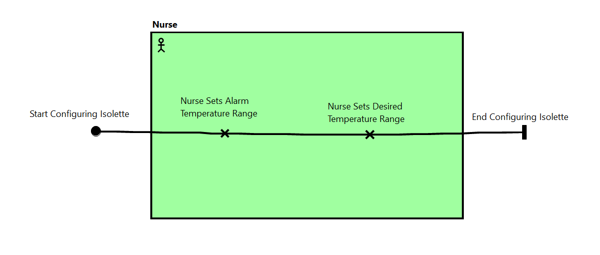

# Isolette

<table>
<tr>
<td> 
  <a href="https://github.com/santoslab/isolette-artifacts/actions/workflows/CI-macOS.yml"></a>
  <a href="https://github.com/santoslab/isolette-artifacts/actions/workflows/CI_linux.yml"></a>
  <a href="https://github.com/santoslab/isolette-artifacts/actions/workflows/CI-windows.yml"></a>
</td>
</table>


## Requirements

[PDF](isolette-requirements/isolette-requirements.pdf)

[Latex Source](isolette-requirements)

## Tool Setup

### Sireum
Install Sireum and IVE by following the instructions: [Getting Started](https://sireum.org/getting-started/).  

It's recommended that you set the environment variable ``SIREUM_HOME`` so that it points to the directory where you installed Sireum.

### OSATE + HAMR

If you want to open/edit the [USE Case Maps](#use-case-maps) in OSATE then install OSATE 2.13 as the jUCMNav plugin generates exceptions in 2.14 (though it is still able to layout the maps correctly).  The following would install OSATE 2.13 in an Applications subdirectory of your home directory.

```bash
#MacOS:
$SIREUM_HOME/bin/sireum hamr phantom --verbose -u -o $HOME/Applications/osate.app --version 2.13.0-vfinal

#Linux: 
$SIREUM_HOME/bin/sireum hamr phantom --verbose -u -o $HOME/Applications/osate --version 2.13.0-vfinal

#Windows: 
%SIREUM_HOME\bin\sireum.bat hamr phantom --verbose -u -o %HOMEPATH%\Applications\osate --version 2.13.0-vfinal
```

If you don't want to use jUCMNav then remove the ``--version`` option and the latest version of OSATE will be installed instead.

### jUCMNav (optional)

Launch OSATE and goto ``Help >> Install New Software ...``  Click ``Add...`` and for ``Name:`` type  *jUCMNav Update Site*

and for the Location: type 
https://raw.githubusercontent.com/JUCMNAV/projetseg/master/seg.jUCMNav.updatesite/

Click ``Add``.  Choose *jUCMNav: URN Editor (UCM and DRL) v7.0.0*.  Continue clicking ``Next >`` until you get to Review Licenses.  Click *I accept the terms of the license agreements*  and click ``Finish``.

On the *Do you trust unsigned content of unknown origin* screen click the checkbox next to Unsigned and click ``Trust Selected``.


## Regenerating the Slang Project

To regenerate from within OSATE, 

- Select ``File >> Import ...``, then choose ``Existing Project into Workspace``.

- Point the select ``Select root directory:`` option at the [./aadl](./aadl) directory
  and import the ``isolette`` project

- Open [./aadl/aadl/packages/Isolette.aadl](./aadl/aadl/packages/Isolette.aadl)

- In the Outline view, select this system implementation: [thermostat_single_sensor.impl](./aadl/aadl/packages/Isolette.aadl#L171)

- Click the HAMR icon in the menu bar (or choose ``OSATE >> Sireum HAMR >> Code Generation``)

- Select the ``JVM`` platform, point the output directory to [./hamr/slang](./hamr/slang/), set the ``Base Package Name`` to be ``isolette`` and click ``Run``.


Or, you can regenerate from the command line by invoking the following script: [./aadl/bin/run-hamr.cmd](./aadl/bin/run-hamr.cmd).  Note that the script requires the ``OSATE_HOME`` environment variable be set.  For example, on Linux do the following

```
export OSATE_HOME=$HOME/Applications/osate
./aadl/bin/run-hamr.cmd
```


## Running the Demo

Follow the directions contained in [./hamr/slang/bin/project.cmd](./hamr/slang/bin/project.cmd#L19-L50) to either run the demo from the command line or from within IVE.

## Running Proyek Logika

From the command line:

```
sireum proyek logika --par --all ./hamr/slang
```

or, invoke the script [./hamr/slang/bin/run-logika.cmd](./hamr/slang/bin/run-logika.cmd)

```
./hamr/slang/bin/run-logika.cmd
```

From within IVE, if the file is in Logika (ie. its first line looks like [this](./hamr/slang/src/main/component/isolette/Monitor/Manage_Alarm_impl_thermostat_monitor_temperature_manage_alarm.scala#L1)) then you can right click the editor and in the context menu choose ``Logika Check (All in File)`` or ``Logika Check (Line)``.

## Use Case Maps

To open the following use case maps in OSATE, install the [jUCMNav](#jucmnav-optional) plugin and then open [aadl/IsoletteOperation.jcum](aadl/IsoletteOperation.jucm) inside OSATE.

Use Case A.2.1


Use Case A.2.2


Use Case A.2.3


Error Case A.2.4


Error Case A.2.5


Error Case A.2.6


